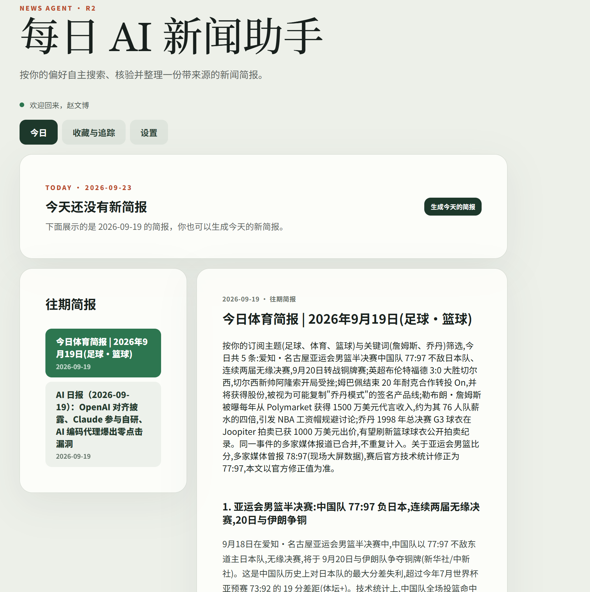
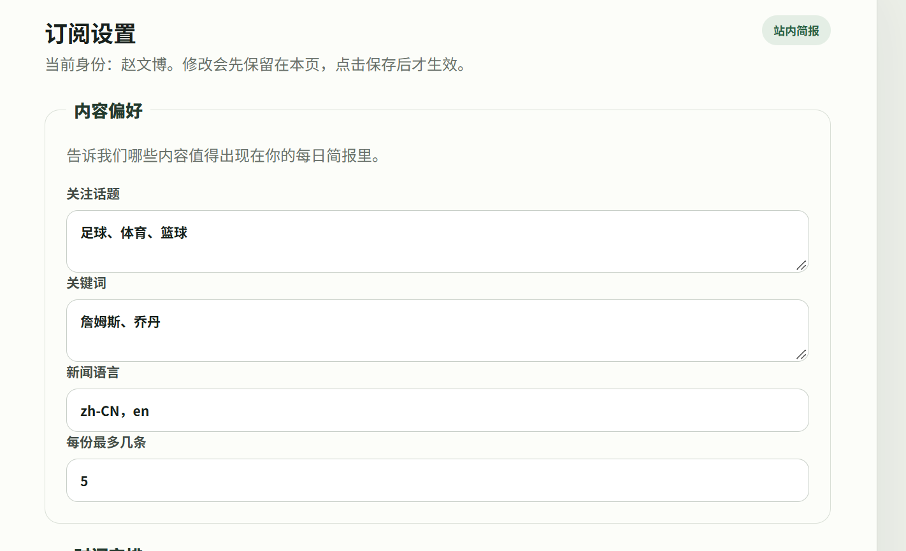
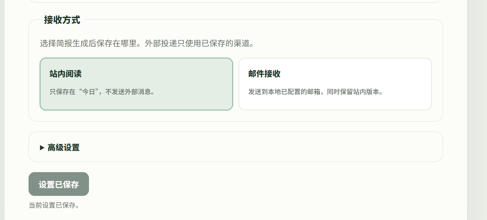
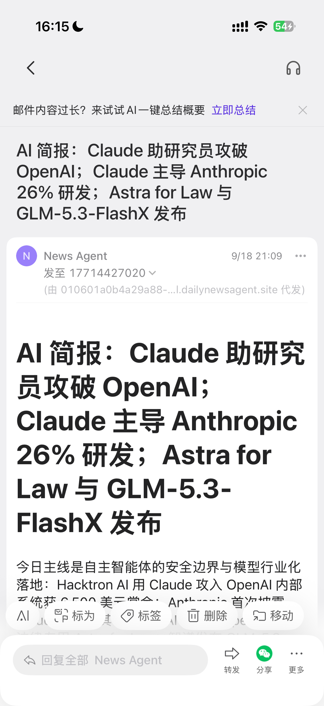
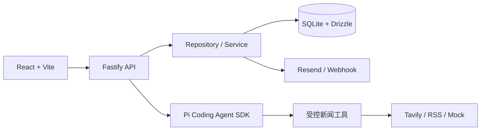

# 每日 AI 新闻助手

一个会按你的关注方向搜索、核验并整理新闻的个人简报 Agent。它不仅能在网页中生成和阅读简报，还能按照已保存的订阅设置，每天自动把结果发送到邮箱或 Webhook。

项目基于 TypeScript npm workspace：前端使用 React + Vite，API 使用 Fastify，数据落在 SQLite；新闻生成由 Pi Coding Agent SDK 编排受控工具完成，并支持 Tavily、RSS 与 Mock 数据源。

> 无 API Key 也能启动完整界面和演示流程；配置 DeepSeek、Tavily 与 Resend 后，可以使用真实新闻搜索和邮件投递。

## 已实现的产品成果

### 一眼读完当天简报

“今日”是默认入口：先呈现当天状态，再阅读完整简报；左侧保留往期内容，用户不需要在多个页面之间寻找结果。



### 按个人兴趣生成，而不是固定信息流

用户可以设置关注话题、关键词、新闻语言和每份简报的条目上限。生成时，Agent 会依据已保存的偏好搜索、筛选、核验并组织内容。



### 网页阅读和外部投递明确分开

简报可以只保留在站内，也可以选择邮件接收。投递严格使用已经保存的设置，避免把尚未保存的表单选择误当成真实订阅状态。



### 每天自动送达邮箱

API 服务持续运行时，后台调度器会按订阅计划生成简报并投递。邮件包含标题、摘要、正文和反馈入口，手机上可以直接阅读，不必先打开网站。

<p align="center">
  
</p>

### 不只是生成，还形成反馈闭环

- 收藏、追踪与稍后处理新闻。
- 对简报和条目提交反馈，帮助后续选题排序。
- 支持跳过当天自动简报、立即投递和投递历史。
- 记录来源健康度、生成质量和投递结果，便于质量运营。
- 异步操作具有处理中、成功、失败、禁用和防重复状态。

## 5 分钟跑起来

### 1. 准备环境

- Node.js 22 或更高版本
- npm 11 或更高版本

```bash
node -v
npm -v
```

### 2. 获取代码并安装依赖

```bash
git clone https://github.com/todaysunnyOvO/news-agent.git
cd news-agent
npm install
```

如果你已经在项目目录中，只需要运行 `npm install`。

### 3. 启动零配置演示

第一次体验不需要创建 `.env`。未提供 DeepSeek 和 Tavily Key 时，API 会自动使用演示模型与 Mock 新闻源。

打开第一个终端，启动 API：

```bash
npm run dev:api
```

打开第二个终端，启动 Web：

```bash
npm run dev:web
```

然后访问：

- Web：<http://localhost:5173>
- API 健康检查：<http://localhost:3000/health>

页面打开后，进入“设置”保存一份订阅偏好，再回到“今日”生成简报即可。

## 接入真实新闻

复制环境变量模板：

PowerShell：

```powershell
Copy-Item .env.example .env
```

macOS / Linux：

```bash
cp .env.example .env
```

至少把下面两个值替换为真实 Key：

```dotenv
DEEPSEEK_API_KEY=your_deepseek_api_key
TAVILY_API_KEY=your_tavily_api_key
```

重新启动 API 后，Agent 将使用 DeepSeek 和 Tavily 获取真实新闻；RSS 来源仍可由新闻工具按配置参与搜索和补充。

> `.env.example` 中的“请填写”只是占位文本，不能作为 Key 使用。想继续使用 Mock 模式时，请不要创建 `.env`，或删除这两个变量。

## 开启每日邮件

在 `.env` 中同时配置以下变量：

```dotenv
RESEND_API_KEY=re_your_resend_api_key
NEWS_AGENT_EMAIL_FROM=News Agent <brief@your-verified-domain.com>
NEWS_AGENT_EMAIL_TO=you@example.com
NEWS_AGENT_FEEDBACK_SIGNING_SECRET=replace_with_a_long_random_secret
NEWS_AGENT_PUBLIC_BASE_URL=http://localhost:5173
```

接着：

1. 重新启动 API。
2. 在“设置”中选择“邮件接收”。
3. 设置每日投递时间并保存订阅偏好。
4. 使用“立即投递”验证邮件配置。

邮件投递需要 Resend 已验证的发件域名。四个邮件必填变量必须同时提供，否则 API 会拒绝以不完整配置启动。

后台自动投递依赖 API 进程持续运行：浏览器可以关闭，但电脑和 API 服务不能停止。用于长期每日推送时，应把 API 部署为持续运行的服务，并把 `NEWS_AGENT_PUBLIC_BASE_URL` 改为用户可访问的站点地址。

## 使用路径

```text
设置关注内容与接收方式
          ↓
保存订阅偏好
          ↓
手动生成，或等待每日调度
          ↓
Agent 搜索、筛选、核验并生成简报
          ↓
站内阅读 / 邮件 / Webhook
          ↓
收藏、追踪和反馈进入下一轮个性化
```

## 系统结构



主要边界保持为：`React → Fastify API → Repository/Service → SQLite`。Agent 不直接访问页面或数据库，只通过受控工具使用新闻能力。

## 常用命令

```bash
# 开发
npm run dev:api
npm run dev:web

# 类型检查与自动化测试
npm run check

# 生产构建
npm run build
```

提交改动前建议至少运行：

```bash
npm run check
npm run build
git diff --check
```

自动化检查只能证明当前测试覆盖的行为通过，不能替代真实邮箱、真实新闻源和目标设备上的产品验证。

## 环境变量速查

| 变量 | 用途 | 本地演示是否必需 |
| --- | --- | --- |
| `HOST` / `PORT` | API 监听地址和端口，默认 `127.0.0.1:3000` | 否 |
| `NEWS_AGENT_DB_PATH` | SQLite 文件位置，默认 `./data/news-agent.sqlite` | 否 |
| `WEB_ORIGIN` | API 允许访问的 Web 来源 | 否 |
| `DEEPSEEK_API_KEY` | 真实模型调用 | 否 |
| `TAVILY_API_KEY` | 真实新闻搜索 | 否 |
| `RESEND_API_KEY` | 邮件投递 | 仅邮件模式 |
| `NEWS_AGENT_EMAIL_FROM` | 已验证的发件地址 | 仅邮件模式 |
| `NEWS_AGENT_EMAIL_TO` | 收件地址 | 仅邮件模式 |
| `NEWS_AGENT_FEEDBACK_SIGNING_SECRET` | 邮件反馈链接签名 | 仅邮件模式 |
| `NEWS_AGENT_PUBLIC_BASE_URL` | 邮件内链接指向的 Web 地址 | 仅邮件模式 |
| `NEWS_AGENT_DELIVERY_WEBHOOK_URL` | Webhook 投递地址 | 仅 Webhook 模式 |

完整示例见 [`.env.example`](.env.example)。不要提交包含真实 Key 或个人邮箱的 `.env`。

## 项目目录

```text
apps/
  api/          Fastify API、调度器和投递入口
  web/          React + Vite 用户界面
packages/
  agent/        Agent 编排与工具注册
  core/         领域模型和业务规则
  database/     SQLite / Drizzle 数据访问
  delivery/     邮件与 Webhook 投递
  news/         Tavily、RSS、Mock 新闻能力
docs/images/    README 产品截图
```

## 常见问题

### 为什么第一次打开就有简报或设置？

项目会持久化数据：服务端数据保存在 SQLite 中，部分浏览器状态保存在本地存储中。重新启动服务不会自动清空这些内容。需要全新体验时，可以使用新的数据库路径和浏览器无痕窗口；不要直接删除仍需保留的数据文件。

### 为什么打开 5173 端口却不是这个项目？

说明该端口已经被另一个 Vite 项目占用。先停止占用端口的旧开发服务，再从本仓库运行 `npm run dev:web`。正确页面标题是“每日 AI 新闻助手”。

### 为什么生成的内容是演示数据？

只有 `DEEPSEEK_API_KEY` 和 `TAVILY_API_KEY` 都有效时才会启用真实运行时。缺少任意一项时，系统会回退到 Mock 演示流程。

### 为什么浏览器关闭后没有收到每日邮件？

浏览器可以关闭，但负责调度和投递的 API 必须持续运行；本机休眠、关机或 API 退出都会中断自动任务。

## API 与进一步开发

API 覆盖用户与订阅、简报生成、每日计划、投递、反馈、收藏追踪、来源健康度和质量运营。需要继续开发时，请先阅读：

- [开发说明](DEVELOPMENT.md)
- [R2 开发说明](R2_DEVELOPMENT.md)
- [体验优化计划](UX_DEVELOPMENT.md)
- [Bug 修复记录](bug修复记录.md)

项目当前不提供托管式生产环境开箱即用配置。生产部署时还需要自行处理 HTTPS、进程守护、反向代理、域名、密钥管理、数据库备份与监控。
